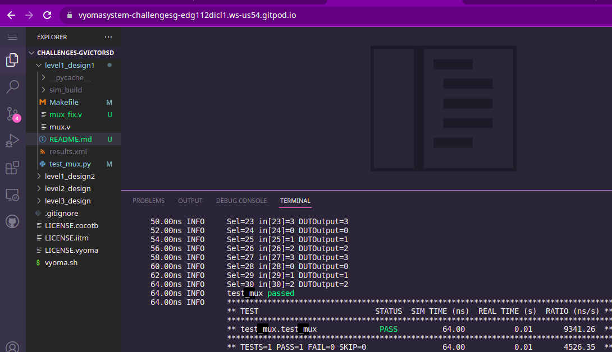
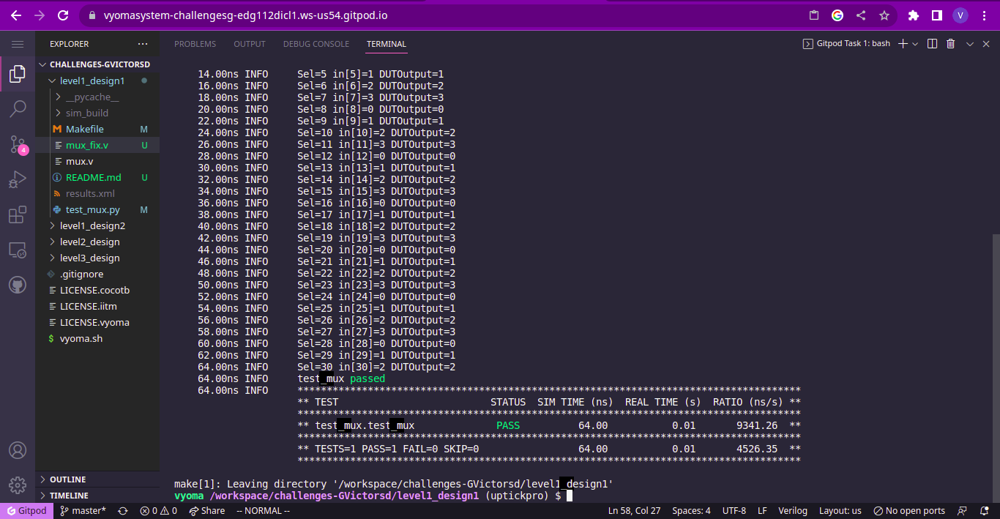

# Adder Design Verification

The verification environment is setup using [Vyoma's UpTickPro](https://vyomasystems.com) provided for the hackathon.

*Make sure to include the Gitpod id in the screenshot*



## Verification Environment

The [CoCoTb](https://www.cocotb.org/) based Python test is developed as explained. The test drives inputs to the Design Under Test (adder module here) which takes in 4-bit inputs *a* and *b* and gives 5-bit output *sum*

The values are assigned to the input port using 
```
dut.inp0.value = 0
dut.inp1.value = 1
dut.inp2.value = 2
dut.inp3.value = 3
dut.inp4.value = 0
dut.inp5.value = 1
dut.inp6.value = 2
dut.inp7.value = 3
dut.inp8.value = 0
dut.inp9.value = 1
dut.inp10.value = 2
dut.inp11.value = 3
dut.inp12.value = 0
dut.inp13.value = 1
dut.inp14.value = 2
dut.inp15.value = 3
dut.inp16.value = 0
dut.inp17.value = 1
dut.inp18.value = 2
dut.inp19.value = 3
dut.inp20.value = 0
dut.inp21.value = 1
dut.inp22.value = 2
dut.inp23.value = 3
dut.inp24.value = 0
dut.inp25.value = 1
dut.inp26.value = 2
dut.inp27.value = 3
dut.inp28.value = 0
dut.inp29.value = 1
dut.inp30.value = 2
```

While the Select input(DUT.sel.value) was driven by a loop passing over values from 0 to 30
```
for i in range(31):
    dut.sel.value = i
    (...)
```

The assert statement is used for comparing the Multiplexers's outut to the expected value.


## Test Scenario - 1

The following error is seen:
```
assert dut.out.value == inputs[i], f"Test failed with: Sel={i}, Expected Output(input[{i}])={inputs[i]}, DUTOutput={int(dut.out.value)}"
AssertionError: Test failed with: Sel=13, Expected Output(input[13])=1, DUTOutput=0
```

- Test Inputs:
    inp13=1, 
    sel=13
- Expected Output: 1
- Observed Output in the DUT dut.out = 0

Output mismatches for the above inputs proving that there is a design bug


## Test Scenario - 2
The following error is seen:
```
assert dut.out.value == inputs[i], f"Test failed with: Sel={i}, Expected Output(input[{i}])={inputs[i]}, DUTOutput={int(dut.out.value)}"
AssertionError: Test failed with: Sel=30, Expected Output(input[30])=2, DUTOutput=0
```

- Test Inputs:
    inp30=2, 
    sel=30
- Expected Output: 2
- Observed Output in the DUT dut.out = 0

Output mismatches for the above inputs proving that there is a design bug

## Design Bug
### Design Bug (1)
Based on the above test input and analysing the design, we see the following

```
    5'b01010: out = inp10;
    5'b01011: out = inp11;
    5'b01101: out = inp12;    ====> BUG(line 40)
    5'b01101: out = inp13;
    5'b01110: out = inp14;
```
The case statement was wrongly configured as 5'b01101 instead of 5'b01100.
This made the 13'th select control produce a wrong output.

This was fixed by updating the line to the following
```
    5'b01100: out = inp12;
```


### Design Bug (2)
Based on the above test input and analysing the design, we see the following

```
      5'b11100: out = inp28;
      5'b11101: out = inp29;     ==> BUG
      default: out = 0;
    endcase
  end
```
Though the case statement was configured for inputs 0 to 29, case 30 was not configured.
This lead to execution of the default statement which produced an output of 0.

This was fixed by adding the following line in the case statement
```
    5'b11110: out = inp30;    // modified line
```

## Design Fix
Updating the design and re-running the test makes the test pass.



The updated design is checked in as mux_fix.v

## Verification Strategy
The design was verified by providing a bunch of random values as inputs for the input lines inp0-inp30 
The select lines are looped over all the input lines to check corresponding output produced by the Design under test.
Each of the individual outputs are verified by comparing them to the corresponding input value.

## Is the verification complete ?
Yes. The verification is complete.