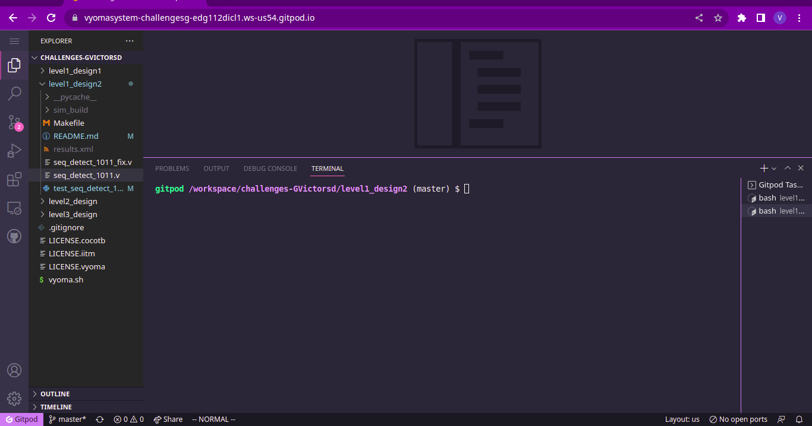
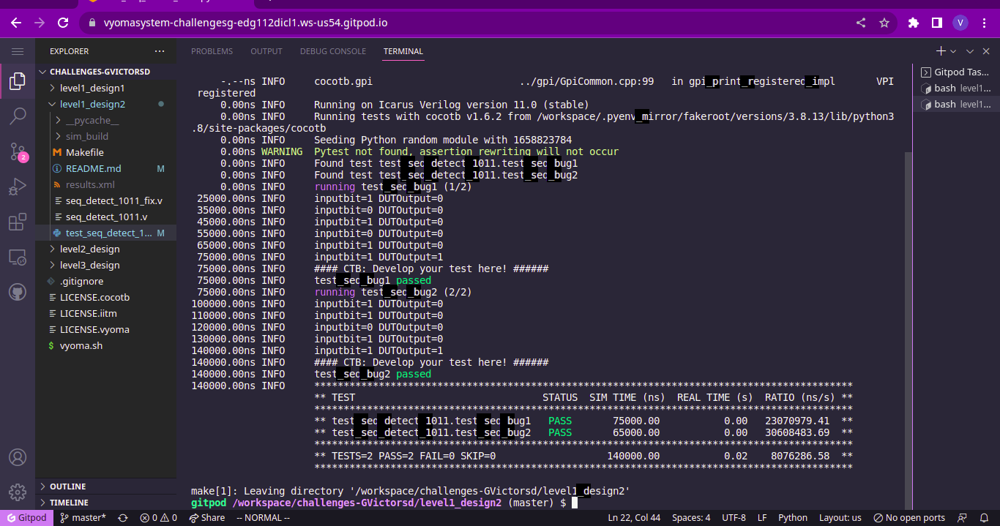

# Sequence Detector (Non Overlapping) Design Verification

The verification environment is setup using [Vyoma's UpTickPro](https://vyomasystems.com) provided for the hackathon.

*Make sure to include the Gitpod id in the screenshot*



## Verification Environment

The [CoCoTb](https://www.cocotb.org/) based Python test is developed as explained. The test drives inputs to the Design Under Test (adder module here) which takes in 4-bit inputs *a* and *b* and gives 5-bit output *sum*

The values are assigned to the input port using 
```
    inputseq = [1,0,1,1,0,1,1]
    for i in inputseq:
        dut.inp_bit.value = i
```

The Clock signal is ticked using the following statement
```
    await FallingEdge(dut.clk)
```

The assert statement is used for comparing the Module's output to the expected value.

## Test Scenario

### Test Scenario - 1
The following error is seen:
```
assert dut.seq_seen.value == checkseq(inputseq, curindex), f"Test failed with: Index={curindex}, Expected Output={checkseq(inputseq, curindex)}, DUTOutput={int(dut.seq_seen.value)}"

AssertionError: Test failed with: Index=4, Expected Output=True, DUTOutput=0
```

- Test Inputs:
    inputseq = [1,1,0,1,1]
- Expected Output sequence = [0,0,0,0,1]
- Observed Output in the DUT dut.seq_seen = [0,0,0,0,0]

Output mismatches for the above inputs proving that there is a design bug

### Test Scenario - 2

The following error is seen:
```
 25000.00ns INFO     inputbit=1 DUTOutput=0
 35000.00ns INFO     inputbit=0 DUTOutput=0
 45000.00ns INFO     inputbit=1 DUTOutput=0
 55000.00ns INFO     inputbit=0 DUTOutput=0
 65000.00ns INFO     inputbit=1 DUTOutput=0
 75000.00ns INFO     inputbit=1 DUTOutput=0
 75000.00ns INFO     test_seq_bug1 failed

assert dut.seq_seen.value == checkseq(inputseq, curindex), f"Test failed with: Index={curindex}, Expected Output={checkseq(inputseq, curindex)}, DUTOutput={int(dut.seq_seen.value)}"
AssertionError: Test failed with: Index=5, Expected Output=True, DUTOutput=0
```

- Test Inputs:
    inputseq = [1,0,1,0,1,1]
- Expected Output sequence = [0,0,0,0,0,1]
- Observed Output in the DUT dut.seq_seen = [0,0,0,0,0,0]

Output mismatches for the above inputs proving that there is a design bug


## Design Bug
### Design Bug (1)
Based on the above test input and analysing the design, we see the following

```
    SEQ_1:
    begin
    if(inp_bit == 1)
        next_state = IDLE;   // Bug
    else
        next_state = SEQ_10;
    end
```
The state transition is wrong for this case.

This was fixed by updating the line to the following
```
    SEQ_1:
    begin
    if(inp_bit == 1)
        next_state = SEQ_1;   // Correct state Transition
    else
        next_state = SEQ_10;
    end
```


### Design Bug (2)
Based on the above test input and analysing the design, we see the following

```
SEQ_101:
begin
if(inp_bit == 1)
    next_state = SEQ_1011;
else
    next_state = IDLE;    //Bug
end
```
The state transition is wrong for this case.

This was fixed by updating the line to the following
```
SEQ_101:
begin
if(inp_bit == 1)
    next_state = SEQ_1011;
else
    next_state = SEQ_10;    //Updated Transiton
end
```

## Design Fix
Updating the design and re-running the test makes the test pass.



The updated design is checked in as mux_fix.v

## Verification Strategy
The clock is generated by the test module. The design is initially reset.
The input sequence to the design is given from the python list over a loop as shown
```
inputseq = [1,0,1,1]
for i in inputseq:
    dut.inp_bit.value = i
```

The intended outputs are generated by a python fuction as shown
```
def checkseq(arr, index):
    if index < 3:
        return False
    return arr[index-3:index+1] == [1,0,1,1]
```

## Is the verification complete ?
Yes. The verification is complete.