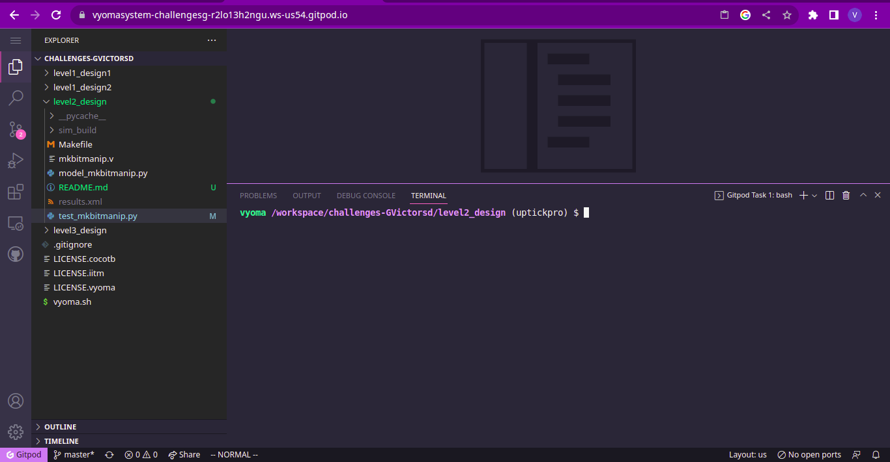
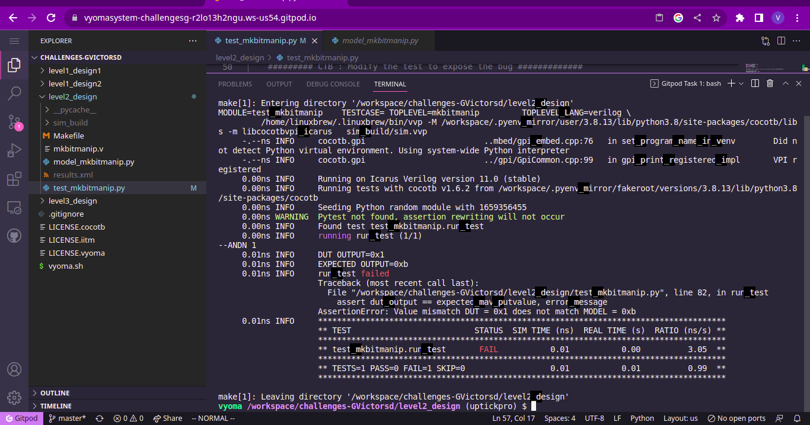
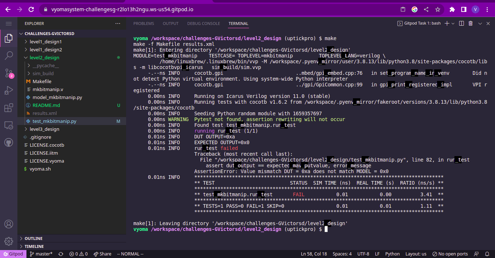

# Bit Manipulation Design Verification

The verification environment is setup using [Vyoma's UpTickPro](https://vyomasystems.com) provided for the hackathon.

*Make sure to include the Gitpod id in the screenshot*



## Verification Environment

The [CoCoTb](https://www.cocotb.org/) based Python test is developed as explained. The test drives inputs to the Design Under Test

The values are assigned to the input port using 
```
    mav_putvalue_src1 = 0x5
    mav_putvalue_src2 = 0x0
    mav_putvalue_src3 = 0x0

    opcode = int('0110011', 2)
    f3 = int('111', 2)
    f7 = int('0100000', 2)
    mav_putvalue_instr = forminst(opcode, f3, f7, 0x0, 0x1, 0x1)
```

The Clock signal is ticked using the following statement
```
    await FallingEdge(dut.clk)
```

The assert statement is used for comparing the Module's output to the expected value.

## Test Scenario

### Test Scenario - 1
The following error is seen:
```
assert dut_output == expected_mav_putvalue, error_message

AssertionError: Value mismatch DUT = 0x1 does not match MODEL = 0xb
```

- Test Inputs:
    mav_putvalue_src1 = 0x5
    mav_putvalue_src2 = 0x0
    mav_putvalue_src3 = 0x0

    opcode = int('0110011', 2)
    f3 = int('111', 2)
    f7 = int('0100000', 2)
    rd = 0x1
    rs1 = 0x0
    rs2 = 0x1

- Expected Output = 0xb
- Observed Output in dut_output = 0x1

Output mismatches for the above inputs proving that there is a design bug

### Test Scenario - 2

The following error is seen:

```
assert dut_output == expected_mav_putvalue, error_message

AssertionError: Value mismatch DUT = 0xa does not match MODEL = 0x0
```

- Test Inputs:
    mav_putvalue_src1 = 0x5
    mav_putvalue_src2 = 0x1
    mav_putvalue_src3 = 0x1

    opcode = int('0110011', 2)
    f3 = int('011', 2)
    f7 = int('0001000', 2)
    rs1 = 0x0
    rs2 = 0x1
    rd = 0x1

- Expected Output = 0x0
- Observed Output in the DUT = 0xa

Output mismatches for the above inputs proving that there is a design bug


## Design Bug
### Design Bug (1)
The following output was observed for the combination of inputs for bug-1



### Design Bug (2)
The following output was observed for the combination of inputs for bug-2



## Verification Strategy
The clock is generated by the test module. The design is initially reset.

The inputs were individually provided using the python script as follows:

```
mav_putvalue_src1 = 0x5
mav_putvalue_src2 = 0x1
mav_putvalue_src3 = 0x1
opcode = int('0110011', 2)
f3 = int('011', 2)
f7 = int('0001000', 2)

mav_putvalue_instr = forminst(opcode, f3, f7, 0x0, 0x1, 0x1)
```

The following function was used to generate the instruction for the given opcode, func3, func7, rs1, rs2 and rd values.

```
def forminst(opcode, f3, f7, a, b, c):
    '''
    inputs: opcode, f3, f7, rs1, rs2, rd
    '''
    res = 0
    res |= int(bin(opcode)[2:].zfill(7), 2)
    res |= int(bin(c)[2:].zfill(5), 2) << 7
    res |= int(bin(f3)[2:].zfill(3),2) << 12
    res |= int(bin(a)[2:].zfill(5), 2) << 15
    res |= int(bin(b)[2:].zfill(5), 2) << 20
    res |= int(bin(f7)[2:].zfill(7), 2) << 25
    return res
```

The intended outputs are generated by a python fuction as shown
```
expected_mav_putvalue = bitmanip(mav_putvalue_instr, mav_putvalue_src1, mav_putvalue_src2, mav_putvalue_src3)
```

## Is the verification complete ?
The bugs were detected by providing different combinations of inputs to the design.