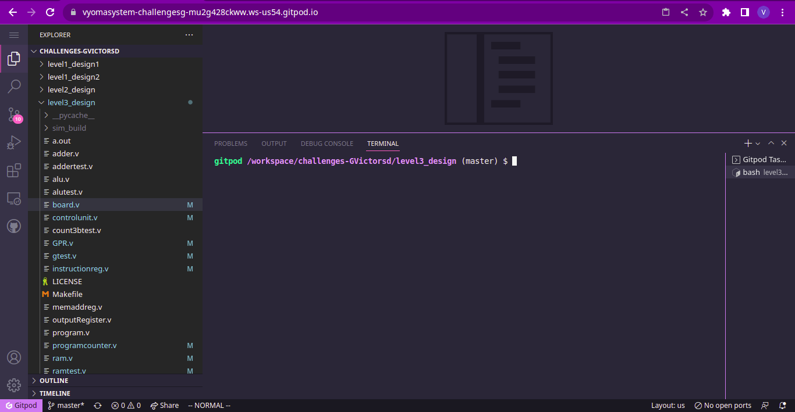
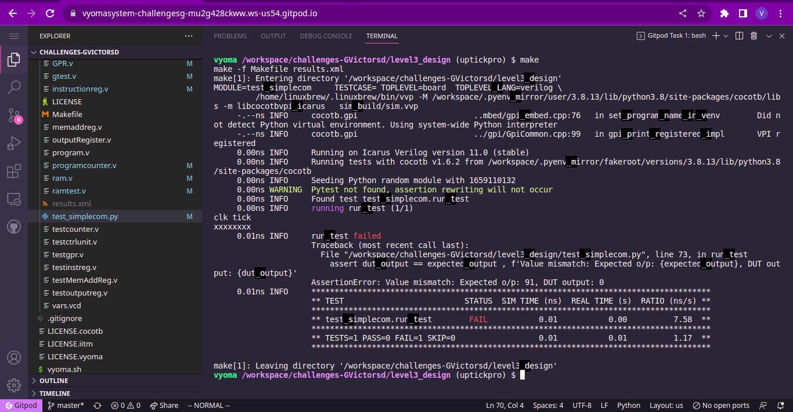

# Simple Computer Design Verification

The verification environment is setup using [Vyoma's UpTickPro](https://vyomasystems.com) provided for the hackathon.



## Verification Environment

The [CoCoTb](https://www.cocotb.org/) based Python test is developed as explained. The test drives inputs to the Design Under Test.

Opcodes for the CPU...

```
# supported instructions and opcodes
nop=0x0
lda=0x1
add=0x2
sub=0x3
sta=0x4
ldi=0x5
jmp=0x6
jc=0x7
jz=0x8
out=0xe
hlt=0xf
```

Instructions loaded into the CPU's Memory
```
# store operands in the memory
dut.rm.mem[0xe].value <= 0x38
dut.rm.mem[0xf].value <= 0x23

# load instructions to the RAM (reset vector- 0x0 )
# program to add two operands
dut.rm.mem[0x0].value <= lda * 0x10 + 0xe
dut.rm.mem[0x1].value <= add * 0x10 + 0xf
dut.rm.mem[0x2].value <= out * 0x10 + 0x0
dut.rm.mem[0x3].value <= hlt * 0x10 + 0x0
```

The Clock signal is ticked using the following statement
```
cocotb.fork(clock_gen(dut.clk))
```

The assert statement is used for comparing the Module's output to the expected value.

## Test Scenario

The following error is seen:
```
assert dut_output == expected_output , f'Value mismatch: Expected o/p: {expected_output}, DUT output: {dut_output}'
AssertionError: Value mismatch: Expected o/p: 91, DUT output: 0
```

- Test Inputs:
    a = 0x38, b = 0x23
- Expected Output= 0x5b
- Observed Output in the DUT dut.display = 0x00

Output mismatches for the above inputs proving that there is a design bug



## Verification Strategy
The clock is generated by the test module.
The instructions and operands are loaded into the RAM.
The system is reset along with its program counter and is driven by the clock to execute the instrucions

According to the given instructions, the CPU would add two operands stored in it's memory, store the result in the output Register and halt.

```
- Test Inputs:
    a = 0x38, b = 0x23
- Expected Output= 0x5b
- Observed Output in the DUT dut.display = 0x00
```

## Source/Reference
The Verilog design was taken from the repository given below which is available under MIT License

[https://github.com/GVictorsd/simple-8bitComputer](https://github.com/GVictorsd/simple-8bitComputer)